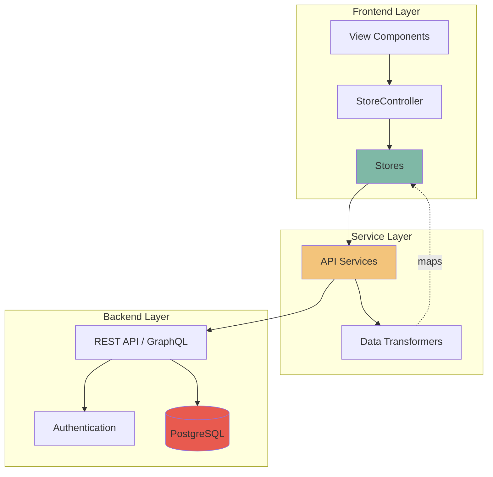

# API Integration Architecture

This document defines the conventions and patterns for connecting the frontend stores to your PostgreSQL backend.

## 🏗️ Architecture Overview



## 📁 Recommended Folder Structure

```
src/
├── stores/
│   ├── index.ts
│   ├── types.ts
│   ├── journal-store.ts
│   ├── budget-store.ts
│   ├── missions-store.ts
│   └── home-store.ts
├── services/
│   ├── api/
│   │   ├── index.ts              # Main API client
│   │   ├── config.ts             # API configuration
│   │   ├── interceptors.ts       # Request/response interceptors
│   │   ├── journal.service.ts    # Journal API calls
│   │   ├── budget.service.ts     # Budget API calls
│   │   ├── missions.service.ts   # Missions API calls
│   │   ├── recipes.service.ts    # Recipes API calls
│   │   ├── auth.service.ts       # Authentication
│   │   └── user.service.ts       # User profile
│   ├── transformers/
│   │   ├── journal.transformer.ts
│   │   ├── budget.transformer.ts
│   │   └── missions.transformer.ts
│   └── storage/
│       ├── local-storage.ts      # LocalStorage wrapper
│       └── indexed-db.ts         # IndexedDB for offline
└── utils/
    ├── http-client.ts            # HTTP wrapper (fetch/axios)
    └── error-handler.ts          # Error handling utilities
```

## 🔌 API Service Conventions

### Base Configuration

```typescript
// src/services/api/config.ts
export const API_CONFIG = {
  baseURL: import.meta.env.VITE_API_BASE_URL || 'http://localhost:3000/api',
  timeout: 30000,
  headers: {
    'Content-Type': 'application/json'
  }
}

export const ENDPOINTS = {
  // Auth
  AUTH: {
    LOGIN: '/auth/login',
    REGISTER: '/auth/register',
    LOGOUT: '/auth/logout',
    REFRESH: '/auth/refresh',
    ME: '/auth/me',
    GOOGLE: '/auth/google',
    GOOGLE_URL: '/auth/google/url',
    GOOGLE_CALLBACK: '/auth/google/callback'
  },
  
  // Journal
  JOURNAL: {
    ENTRIES: '/journal/entries',
    ENTRY: (id: string) => `/journal/entries/${id}`,
    MEALS: '/journal/meals',
    PURCHASES: '/journal/purchases',
    LINK_MEAL: (mealId: string) => `/journal/meals/${mealId}/link-purchase`
  },
  
  // Budget
  BUDGET: {
    STATS: '/budget/stats',
    ENTRIES: '/budget/entries',
    ENTRY: (id: string) => `/budget/entries/${id}`,
    ANALYTICS: '/budget/analytics',
    CATEGORY_BREAKDOWN: '/budget/category-breakdown'
  },
  
  // Missions
  MISSIONS: {
    LIST: '/missions',
    ACTIVE: '/missions/active',
    START: (id: string) => `/missions/${id}/start`,
    COMPLETE: (id: string) => `/missions/${id}/complete`,
    UPDATE_PROGRESS: (id: string) => `/missions/${id}/progress`
  },
  
  // Challenges
  CHALLENGES: {
    LIST: '/challenges',
    ACTIVE: '/challenges/active',
    JOIN: (id: string) => `/challenges/${id}/join`,
    UPDATE_GOAL: (challengeId: string, goalId: string) => 
      `/challenges/${challengeId}/goals/${goalId}`
  },
  
  // Recipes
  RECIPES: {
    LIST: '/recipes',
    RECIPE: (id: string) => `/recipes/${id}`,
    SEARCH: '/recipes/search',
    FEATURED: '/recipes/featured',
    BY_CATEGORY: (category: string) => `/recipes/category/${category}`
  },
  
  // Meal Plans
  MEAL_PLANS: {
    LIST: '/meal-plans',
    PLAN: (id: string) => `/meal-plans/${id}`,
    CURRENT: '/meal-plans/current',
    WEEK: '/meal-plans/week', // Get/create plan for specific week
    CREATE: '/meal-plans',
    ADD_MEAL: (planId: string) => `/meal-plans/${planId}/meals`,
    UPDATE_MEAL: (planId: string, mealId: string) => `/meal-plans/${planId}/meals/${mealId}`,
    DELETE_MEAL: (planId: string, mealId: string) => `/meal-plans/${planId}/meals/${mealId}`,
    ADD_SHOPPING_ITEM: (planId: string) => `/meal-plans/${planId}/shopping-list`,
    UPDATE_SHOPPING_ITEM: (planId: string, itemId: string) => 
      `/meal-plans/${planId}/shopping-list/${itemId}`,
    DELETE_SHOPPING_ITEM: (planId: string, itemId: string) => 
      `/meal-plans/${planId}/shopping-list/${itemId}`
  },
  
  // User
  USER: {
    PROFILE: '/user/profile',
    PREFERENCES: '/user/preferences',
    STATS: '/user/stats'
  }
}
```

### HTTP Client Wrapper

```typescript
// src/utils/http-client.ts
export interface HttpClientConfig {
  baseURL: string
  timeout?: number
  headers?: Record<string, string>
}

export interface RequestConfig {
  method: 'GET' | 'POST' | 'PUT' | 'PATCH' | 'DELETE'
  url: string
  data?: any
  params?: Record<string, string | number | boolean>
  headers?: Record<string, string>
  signal?: AbortSignal
}

export class HttpClient {
  private baseURL: string
  private defaultHeaders: Record<string, string>
  private timeout: number

  constructor(config: HttpClientConfig) {
    this.baseURL = config.baseURL
    this.defaultHeaders = config.headers || {}
    this.timeout = config.timeout || 30000
  }

  // Get auth token from storage
  private getAuthToken(): string | null {
    return localStorage.getItem('auth_token')
  }

  // Build full URL with query params
  private buildURL(url: string, params?: Record<string, any>): string {
    const fullURL = url.startsWith('http') ? url : `${this.baseURL}${url}`
    
    if (!params) return fullURL
    
    const queryString = Object.entries(params)
      .map(([key, value]) => `${encodeURIComponent(key)}=${encodeURIComponent(value)}`)
      .join('&')
    
    return `${fullURL}?${queryString}`
  }

  // Main request method
  async request<T>(config: RequestConfig): Promise<T> {
    const token = this.getAuthToken()
    const headers = {
      ...this.defaultHeaders,
      ...(token ? { Authorization: `Bearer ${token}` } : {}),
      ...config.headers
    }

    const url = this.buildURL(config.url, config.params)
    
    const controller = new AbortController()
    const timeoutId = setTimeout(() => controller.abort(), this.timeout)

    try {
      const response = await fetch(url, {
        method: config.method,
        headers,
        body: config.data ? JSON.stringify(config.data) : undefined,
        signal: config.signal || controller.signal
      })

      clearTimeout(timeoutId)

      if (!response.ok) {
        throw await this.handleError(response)
      }

      // Handle empty responses
      const contentType = response.headers.get('content-type')
      if (!contentType?.includes('application/json')) {
        return {} as T
      }

      return await response.json()
    } catch (error) {
      clearTimeout(timeoutId)
      throw error
    }
  }

  // Convenience methods
  async get<T>(url: string, params?: Record<string, any>): Promise<T> {
    return this.request<T>({ method: 'GET', url, params })
  }

  async post<T>(url: string, data?: any): Promise<T> {
    return this.request<T>({ method: 'POST', url, data })
  }

  async put<T>(url: string, data?: any): Promise<T> {
    return this.request<T>({ method: 'PUT', url, data })
  }

  async patch<T>(url: string, data?: any): Promise<T> {
    return this.request<T>({ method: 'PATCH', url, data })
  }

  async delete<T>(url: string): Promise<T> {
    return this.request<T>({ method: 'DELETE', url })
  }

  private async handleError(response: Response): Promise<Error> {
    let errorMessage = `HTTP ${response.status}: ${response.statusText}`
    
    try {
      const errorData = await response.json()
      errorMessage = errorData.message || errorMessage
    } catch {
      // Ignore JSON parse errors
    }

    return new Error(errorMessage)
  }
}

// Create and export singleton
export const httpClient = new HttpClient({
  baseURL: API_CONFIG.baseURL,
  timeout: API_CONFIG.timeout,
  headers: API_CONFIG.headers
})
```

## 📡 API Service Example (Journal)

```typescript
// src/services/api/journal.service.ts
import { httpClient } from '../../utils/http-client'
import { ENDPOINTS } from './config'
import type { 
  JournalEntry, 
  Meal, 
  Purchase 
} from '../../stores/types'

// DTO types (match your PostgreSQL schema)
export interface PurchaseItemDTO {
  name: string
  quantity?: string
  cost: number
  category?: 'produce' | 'protein' | 'dairy' | 'pantry' | 'frozen' | 'other'
}

export interface JournalEntryDTO {
  id: string
  user_id: string
  type: 'meal' | 'purchase'
  timestamp: string  // ISO string from DB
  title: string
  meal_type?: string
  portions?: number
  portions_left?: number
  status?: string
  ingredients_used?: string[]
  store?: string
  items?: PurchaseItemDTO[] // Each item with individual cost
  total_cost?: number // Calculated from items
  purchase_id?: string
  related_meal_ids?: string[]
  created_at: string
  updated_at: string
}

export interface CreateJournalEntryDTO {
  type: 'meal' | 'purchase'
  title: string
  meal_type?: string
  portions?: number
  status?: string
  store?: string
  items?: PurchaseItemDTO[]
  total_cost?: number
}

export interface UpdateJournalEntryDTO {
  title?: string
  portions?: number
  portions_left?: number
  status?: string
  items?: PurchaseItemDTO[]
  total_cost?: number
}

export interface LinkMealToPurchaseDTO {
  purchase_id: string
  ingredients_used: string[]
}

class JournalService {
  // GET /journal/entries
  async getEntries(): Promise<JournalEntryDTO[]> {
    return httpClient.get(ENDPOINTS.JOURNAL.ENTRIES)
  }

  // GET /journal/entries/:id
  async getEntry(id: string): Promise<JournalEntryDTO> {
    return httpClient.get(ENDPOINTS.JOURNAL.ENTRY(id))
  }

  // POST /journal/entries
  async createEntry(data: CreateJournalEntryDTO): Promise<JournalEntryDTO> {
    return httpClient.post(ENDPOINTS.JOURNAL.ENTRIES, data)
  }

  // PATCH /journal/entries/:id
  async updateEntry(id: string, data: UpdateJournalEntryDTO): Promise<JournalEntryDTO> {
    return httpClient.patch(ENDPOINTS.JOURNAL.ENTRY(id), data)
  }

  // DELETE /journal/entries/:id
  async deleteEntry(id: string): Promise<void> {
    return httpClient.delete(ENDPOINTS.JOURNAL.ENTRY(id))
  }

  // GET /journal/meals
  async getMeals(): Promise<JournalEntryDTO[]> {
    return httpClient.get(ENDPOINTS.JOURNAL.MEALS)
  }

  // GET /journal/purchases
  async getPurchases(): Promise<JournalEntryDTO[]> {
    return httpClient.get(ENDPOINTS.JOURNAL.PURCHASES)
  }

  // POST /journal/meals/:mealId/link-purchase
  async linkMealToPurchase(
    mealId: string, 
    data: LinkMealToPurchaseDTO
  ): Promise<JournalEntryDTO> {
    return httpClient.post(ENDPOINTS.JOURNAL.LINK_MEAL(mealId), data)
  }

  // GET /journal/entries?type=purchase&has_meals=true
  async getPurchasesWithMeals(): Promise<JournalEntryDTO[]> {
    return httpClient.get(ENDPOINTS.JOURNAL.ENTRIES, {
      type: 'purchase',
      has_meals: true
    })
  }
}

export const journalService = new JournalService()
```

## 📡 API Service Example (Meal Plans)

```typescript
// src/services/api/meal-plan.service.ts
import { httpClient } from '../../utils/http-client'
import { ENDPOINTS } from './config'
import type { 
  MealPlan, 
  PlannedMeal, 
  ShoppingListItem 
} from '../../stores/types'

// DTO types
export interface MealPlanDTO {
  id: string
  user_id: string
  name: string
  start_date: string
  end_date: string
  total_cost?: number
  status: 'draft' | 'active' | 'completed'
  meals: PlannedMealDTO[]
  shopping_list: ShoppingListItemDTO[]
  created_at: string
  updated_at: string
}

export interface PlannedMealDTO {
  id: string
  meal_plan_id: string
  date: string
  meal_type: string
  recipe_id?: string
  recipe_name: string
  servings: number
  is_batch: boolean
  is_leftovers: boolean
}

export interface ShoppingListItemDTO {
  id: string
  meal_plan_id: string
  name: string
  quantity: string
  category: string
  purchased: boolean
  estimated_cost?: number
  related_recipes?: string[]
}

export interface CreateMealPlanDTO {
  name: string
  start_date: string
  end_date: string
}

export interface AddMealDTO {
  date: string
  meal_type: string
  recipe_id?: string
  recipe_name: string
  servings: number
}

class MealPlanService {
  // GET /meal-plans
  async getPlans(): Promise<MealPlanDTO[]> {
    return httpClient.get(ENDPOINTS.MEAL_PLANS.LIST)
  }

  // GET /meal-plans/:id
  async getPlan(id: string): Promise<MealPlanDTO> {
    return httpClient.get(ENDPOINTS.MEAL_PLANS.PLAN(id))
  }

  // GET /meal-plans/current
  async getCurrentPlan(): Promise<MealPlanDTO> {
    return httpClient.get(ENDPOINTS.MEAL_PLANS.CURRENT)
  }

  // GET /meal-plans/week?date={date}
  // Gets or creates meal plan for the week containing the given date
  async getPlanForWeek(date: Date): Promise<MealPlanDTO> {
    const dateStr = date.toISOString().split('T')[0] // 'YYYY-MM-DD'
    return httpClient.get(ENDPOINTS.MEAL_PLANS.WEEK, { date: dateStr })
  }

  // POST /meal-plans
  async createPlan(data: CreateMealPlanDTO): Promise<MealPlanDTO> {
    return httpClient.post(ENDPOINTS.MEAL_PLANS.CREATE, data)
  }

  // PATCH /meal-plans/:id
  async updatePlan(
    id: string, 
    updates: Partial<MealPlanDTO>
  ): Promise<MealPlanDTO> {
    return httpClient.patch(ENDPOINTS.MEAL_PLANS.PLAN(id), updates)
  }

  // DELETE /meal-plans/:id
  async deletePlan(id: string): Promise<void> {
    return httpClient.delete(ENDPOINTS.MEAL_PLANS.PLAN(id))
  }

  // POST /meal-plans/:planId/meals
  async addMeal(planId: string, meal: AddMealDTO): Promise<PlannedMealDTO> {
    return httpClient.post(ENDPOINTS.MEAL_PLANS.ADD_MEAL(planId), meal)
  }

  // PATCH /meal-plans/:planId/meals/:mealId
  async updateMeal(
    planId: string, 
    mealId: string, 
    updates: Partial<PlannedMealDTO>
  ): Promise<PlannedMealDTO> {
    return httpClient.patch(
      ENDPOINTS.MEAL_PLANS.UPDATE_MEAL(planId, mealId), 
      updates
    )
  }

  // DELETE /meal-plans/:planId/meals/:mealId
  async deleteMeal(planId: string, mealId: string): Promise<void> {
    return httpClient.delete(ENDPOINTS.MEAL_PLANS.DELETE_MEAL(planId, mealId))
  }

  // POST /meal-plans/:planId/shopping-list
  async addShoppingItem(
    planId: string, 
    item: Partial<ShoppingListItemDTO>
  ): Promise<ShoppingListItemDTO> {
    return httpClient.post(
      ENDPOINTS.MEAL_PLANS.ADD_SHOPPING_ITEM(planId), 
      item
    )
  }

  // PATCH /meal-plans/:planId/shopping-list/:itemId
  async updateShoppingItem(
    planId: string, 
    itemId: string, 
    updates: Partial<ShoppingListItemDTO>
  ): Promise<ShoppingListItemDTO> {
    return httpClient.patch(
      ENDPOINTS.MEAL_PLANS.UPDATE_SHOPPING_ITEM(planId, itemId),
      updates
    )
  }

  // DELETE /meal-plans/:planId/shopping-list/:itemId
  async deleteShoppingItem(planId: string, itemId: string): Promise<void> {
    return httpClient.delete(
      ENDPOINTS.MEAL_PLANS.DELETE_SHOPPING_ITEM(planId, itemId)
    )
  }

  // Helper: Get week date range
  getWeekRange(date: Date): { start: Date; end: Date } {
    const day = date.getDay()
    const diff = date.getDate() - day + (day === 0 ? -6 : 1) // Monday as first day
    const start = new Date(date)
    start.setDate(diff)
    start.setHours(0, 0, 0, 0)
    
    const end = new Date(start)
    end.setDate(start.getDate() + 6)
    end.setHours(23, 59, 59, 999)
    
    return { start, end }
  }
}

export const mealPlanService = new MealPlanService()
```

## 🔄 Data Transformers

```typescript
// src/services/transformers/journal.transformer.ts
import type { JournalEntry, Meal, Purchase } from '../../stores/types'
import type { JournalEntryDTO } from '../api/journal.service'

export class JournalTransformer {
  // Transform DTO from API to frontend type
  static toJournalEntry(dto: JournalEntryDTO): JournalEntry {
    return {
      id: dto.id,
      type: dto.type,
      timestamp: new Date(dto.timestamp),
      title: dto.title,
      mealType: dto.meal_type as any,
      portions: dto.portions,
      portionsLeft: dto.portions_left,
      status: dto.status as any,
      ingredientsUsed: dto.ingredients_used,
      store: dto.store,
      items: dto.items, // PurchaseItem[] structure preserved
      totalCost: dto.total_cost,
      purchaseId: dto.purchase_id,
      relatedMealIds: dto.related_meal_ids
    }
  }

  // Transform frontend type to DTO for API
  static toDTO(entry: Omit<JournalEntry, 'id' | 'timestamp'>): Partial<JournalEntryDTO> {
    return {
      type: entry.type,
      title: entry.title,
      meal_type: entry.mealType,
      portions: entry.portions,
      portions_left: entry.portionsLeft,
      status: entry.status,
      ingredients_used: entry.ingredientsUsed,
      store: entry.store,
      items: entry.items, // PurchaseItem[] structure preserved
      total_cost: entry.totalCost,
      purchase_id: entry.purchaseId,
      related_meal_ids: entry.relatedMealIds
    }
  }

  // Transform array
  static toJournalEntries(dtos: JournalEntryDTO[]): JournalEntry[] {
    return dtos.map(dto => this.toJournalEntry(dto))
  }
}
```

## 🏪 Store Integration Pattern

```typescript
// src/stores/journal-store.ts (Updated with API integration)
import { BaseStore } from './base-store'
import type { JournalEntry, Meal, Purchase } from './types'
import { journalService } from '../services/api/journal.service'
import { JournalTransformer } from '../services/transformers/journal.transformer'

class JournalStore extends BaseStore {
  private entries: JournalEntry[] = []
  private loading = false
  private error: Error | null = null

  constructor() {
    super()
    // Don't load mock data anymore
    // this.loadMockData()
  }

  // State getters
  isLoading(): boolean {
    return this.loading
  }

  getError(): Error | null {
    return this.error
  }

  // Fetch entries from API
  async fetchEntries(): Promise<void> {
    this.loading = true
    this.error = null
    this.notify()

    try {
      const dtos = await journalService.getEntries()
      this.entries = JournalTransformer.toJournalEntries(dtos)
      this.loading = false
      this.notify()
    } catch (error) {
      this.error = error as Error
      this.loading = false
      this.notify()
    }
  }

  // Add entry (API)
  async addEntry(entry: Omit<JournalEntry, 'id' | 'timestamp'>): Promise<void> {
    try {
      const dto = await journalService.createEntry(
        JournalTransformer.toDTO(entry) as any
      )
      const newEntry = JournalTransformer.toJournalEntry(dto)
      this.entries.push(newEntry)
      this.notify()
    } catch (error) {
      this.error = error as Error
      this.notify()
      throw error
    }
  }

  // Update entry (API)
  async updateEntry(id: string, updates: Partial<JournalEntry>): Promise<void> {
    try {
      const dto = await journalService.updateEntry(id, updates as any)
      const index = this.entries.findIndex(e => e.id === id)
      if (index !== -1) {
        this.entries[index] = JournalTransformer.toJournalEntry(dto)
        this.notify()
      }
    } catch (error) {
      this.error = error as Error
      this.notify()
      throw error
    }
  }

  // Delete entry (API)
  async deleteEntry(id: string): Promise<void> {
    try {
      await journalService.deleteEntry(id)
      this.entries = this.entries.filter(e => e.id !== id)
      this.notify()
    } catch (error) {
      this.error = error as Error
      this.notify()
      throw error
    }
  }

  // Link meal to purchase (API)
  async linkMealToPurchase(
    mealId: string, 
    purchaseId: string, 
    ingredientsUsed: string[]
  ): Promise<void> {
    try {
      await journalService.linkMealToPurchase(mealId, {
        purchase_id: purchaseId,
        ingredients_used: ingredientsUsed
      })
      
      // Refresh entries to get updated relationships
      await this.fetchEntries()
    } catch (error) {
      this.error = error as Error
      this.notify()
      throw error
    }
  }

  // Existing getters remain the same
  getEntries(): JournalEntry[] {
    return [...this.entries].sort((a, b) => 
      b.timestamp.getTime() - a.timestamp.getTime()
    )
  }

  getEntriesGroupedByPurchase(): Array<{ purchase?: Purchase; meals: Meal[] }> {
    // Implementation stays the same
    // ...
  }
}

export const journalStore = new JournalStore()
```

## 🔐 Authentication Service

```typescript
// src/services/api/auth.service.ts
import { httpClient } from '../../utils/http-client'
import { ENDPOINTS } from './config'

export interface LoginCredentials {
  email: string
  password: string
}

export interface RegisterData {
  name: string
  email: string
  password: string
}

export interface AuthResponse {
  token: string
  refresh_token: string
  user: {
    id: string
    name: string
    email: string
    avatar_url?: string
    oauth_provider?: 'google' | 'facebook' | 'apple'
  }
}

export interface GoogleAuthRequest {
  token: string // Google OAuth token from client
}

export interface GoogleCallbackRequest {
  code: string // Authorization code from Google
}

class AuthService {
  async login(credentials: LoginCredentials): Promise<AuthResponse> {
    const response = await httpClient.post<AuthResponse>(
      ENDPOINTS.AUTH.LOGIN,
      credentials
    )
    
    // Store tokens
    localStorage.setItem('auth_token', response.token)
    localStorage.setItem('refresh_token', response.refresh_token)
    
    return response
  }

  async register(data: RegisterData): Promise<AuthResponse> {
    const response = await httpClient.post<AuthResponse>(
      ENDPOINTS.AUTH.REGISTER,
      data
    )
    
    localStorage.setItem('auth_token', response.token)
    localStorage.setItem('refresh_token', response.refresh_token)
    
    return response
  }

  async logout(): Promise<void> {
    await httpClient.post(ENDPOINTS.AUTH.LOGOUT)
    localStorage.removeItem('auth_token')
    localStorage.removeItem('refresh_token')
  }

  async refreshToken(): Promise<string> {
    const refreshToken = localStorage.getItem('refresh_token')
    if (!refreshToken) throw new Error('No refresh token')

    const response = await httpClient.post<AuthResponse>(
      ENDPOINTS.AUTH.REFRESH,
      { refresh_token: refreshToken }
    )

    localStorage.setItem('auth_token', response.token)
    return response.token
  }

  // Google OAuth - One-tap flow (recommended)
  async loginWithGoogle(googleToken: string): Promise<AuthResponse> {
    const response = await httpClient.post<AuthResponse>(
      ENDPOINTS.AUTH.GOOGLE,
      { token: googleToken }
    )
    
    localStorage.setItem('auth_token', response.token)
    localStorage.setItem('refresh_token', response.refresh_token)
    
    return response
  }

  // Google OAuth - Redirect flow (alternative)
  async getGoogleAuthUrl(): Promise<string> {
    const response = await httpClient.get<{ url: string }>(
      ENDPOINTS.AUTH.GOOGLE_URL
    )
    return response.url
  }

  async handleGoogleCallback(code: string): Promise<AuthResponse> {
    const response = await httpClient.post<AuthResponse>(
      ENDPOINTS.AUTH.GOOGLE_CALLBACK,
      { code }
    )
    
    localStorage.setItem('auth_token', response.token)
    localStorage.setItem('refresh_token', response.refresh_token)
    
    return response
  }

  isAuthenticated(): boolean {
    return !!localStorage.getItem('auth_token')
  }
}

export const authService = new AuthService()
```

## 📋 Naming Conventions Summary

### API Endpoints
- **REST style**: `/resource` or `/resource/:id`
- **Actions**: `/resource/:id/action` (e.g., `/missions/123/complete`)
- **Nested resources**: `/resource/:id/subresource`
- **Query params**: For filtering, pagination, sorting

### Service Method Names
- `get{Resource}()` - Fetch single item
- `get{Resources}()` - Fetch list
- `create{Resource}()` - Create new
- `update{Resource}()` - Update existing
- `delete{Resource}()` - Delete item
- `{action}{Resource}()` - Custom actions (e.g., `completeMission()`)

### Database Column Names
- **Snake case**: `user_id`, `created_at`, `portions_left`
- **Timestamps**: `created_at`, `updated_at`
- **Foreign keys**: `{table}_id` (e.g., `purchase_id`, `user_id`)

### TypeScript Conventions
- **DTO suffix**: For API response types (`JournalEntryDTO`)
- **Camel case**: Frontend types (`portionsLeft`)
- **Transformers**: Convert between DTO ↔ Frontend types

## 🎯 Key Integration Points

1. **Initial Load**: Call `store.fetchEntries()` in component `connectedCallback()`
2. **User Actions**: Call store methods, which call API, then notify
3. **Loading States**: Use `store.isLoading()` to show spinners
4. **Error Handling**: Use `store.getError()` to display errors
5. **Optimistic Updates**: Optional - update local state first, rollback on error
6. **Offline Support**: Use IndexedDB to cache data, sync when online

## 🗓️ Planning View Week Navigation Example

```typescript
// src/views/planning-view.ts
import { LitElement, html } from 'lit'
import { customElement, state } from 'lit/decorators.js'
import { mealPlanService } from '../services/api/meal-plan.service'

@customElement('planning-view')
export class PlanningView extends LitElement {
  @state() private currentDate = new Date()
  @state() private currentPlan: MealPlan | null = null
  @state() private loading = false

  async connectedCallback() {
    super.connectedCallback()
    await this.loadWeekPlan()
  }

  private async loadWeekPlan() {
    this.loading = true
    try {
      // Get or create plan for current week
      const dto = await mealPlanService.getPlanForWeek(this.currentDate)
      this.currentPlan = {
        ...dto,
        startDate: new Date(dto.start_date),
        endDate: new Date(dto.end_date),
        meals: dto.meals.map(m => ({
          ...m,
          date: new Date(m.date)
        }))
      }
    } catch (error) {
      console.error('Failed to load meal plan:', error)
    } finally {
      this.loading = false
    }
  }

  private async navigateWeek(direction: 'prev' | 'next') {
    // Calculate new week
    const daysToAdd = direction === 'next' ? 7 : -7
    this.currentDate = new Date(this.currentDate)
    this.currentDate.setDate(this.currentDate.getDate() + daysToAdd)
    
    // Load that week's plan (different MealPlan record)
    await this.loadWeekPlan()
  }

  private async addMealToWeek(date: Date, mealType: string, recipeId: string) {
    if (!this.currentPlan) return

    try {
      await mealPlanService.addMeal(this.currentPlan.id, {
        date: date.toISOString().split('T')[0],
        meal_type: mealType,
        recipe_id: recipeId,
        recipe_name: 'Recipe Name', // Get from recipe
        servings: 2
      })
      
      // Reload plan to show new meal
      await this.loadWeekPlan()
    } catch (error) {
      console.error('Failed to add meal:', error)
    }
  }

  render() {
    if (this.loading) {
      return html`<loading-spinner></loading-spinner>`
    }

    if (!this.currentPlan) {
      return html`<div>No plan for this week</div>`
    }

    const { start, end } = mealPlanService.getWeekRange(this.currentDate)

    return html`
      <div class="planning-view">
        <!-- Week Navigation -->
        <div class="week-nav">
          <button @click=${() => this.navigateWeek('prev')}>
            ← Previous Week
          </button>
          <h2>
            ${start.toLocaleDateString()} - ${end.toLocaleDateString()}
          </h2>
          <button @click=${() => this.navigateWeek('next')}>
            Next Week →
          </button>
        </div>

        <!-- Meals for THIS WEEK ONLY -->
        <div class="meals">
          ${this.currentPlan.meals.map(meal => html`
            <div class="meal-card">
              <div>${meal.date.toLocaleDateString()}</div>
              <div>${meal.mealType}</div>
              <div>${meal.recipeName}</div>
            </div>
          `)}
        </div>

        <!-- Shopping list for THIS WEEK ONLY -->
        <div class="shopping-list">
          <h3>Shopping List</h3>
          ${this.currentPlan.shoppingList?.map(item => html`
            <label>
              <input 
                type="checkbox" 
                .checked=${item.purchased}
                @change=${() => this.toggleShoppingItem(item.id)}
              />
              ${item.name} - ${item.quantity}
            </label>
          `)}
        </div>
      </div>
    `
  }

  private async toggleShoppingItem(itemId: string) {
    if (!this.currentPlan) return

    const item = this.currentPlan.shoppingList?.find(i => i.id === itemId)
    if (!item) return

    try {
      await mealPlanService.updateShoppingItem(
        this.currentPlan.id, 
        itemId, 
        { purchased: !item.purchased }
      )
      await this.loadWeekPlan()
    } catch (error) {
      console.error('Failed to update shopping item:', error)
    }
  }
}
```

---

This architecture provides:
✅ Clean separation of concerns
✅ Type safety throughout
✅ Easy testing (mock services)
✅ Consistent error handling
✅ Scalable structure
✅ TypeScript support
