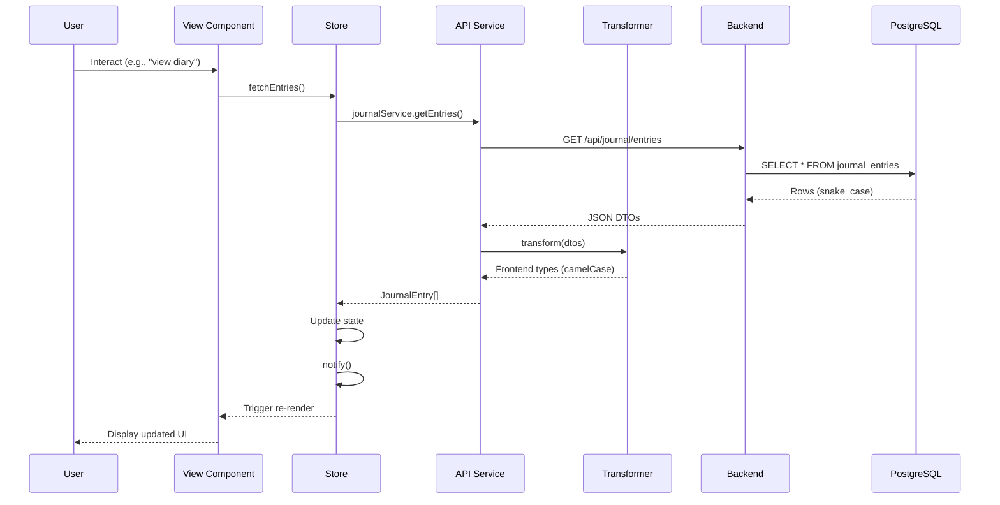

# Backend Integration - Quick Reference

## 📄 Documentation Files Created

This is your complete guide to connecting the GoMums frontend to a PostgreSQL backend.

### 1. **DATABASE_SCHEMA.sql**
Complete PostgreSQL schema with all tables, indexes, triggers, and views.

**What's included:**
- ✅ 20+ tables covering all app features
- ✅ Foreign key relationships
- ✅ Indexes for performance
- ✅ Auto-updating `updated_at` triggers
- ✅ Useful views for common queries
- ✅ Check constraints for data validation

**How to use:**
```bash
psql -U postgres -d gomums -f DATABASE_SCHEMA.sql
```

---

### 2. **API_ENDPOINTS.md**
Complete REST API reference with all 50+ endpoints.

**What's included:**
- ✅ Request/response examples for every endpoint
- ✅ Query parameters and filtering options
- ✅ HTTP status codes
- ✅ Authentication requirements

**Sections:**
- 🔐 Authentication (login, register, refresh)
- 📔 Journal (meals, purchases, linking)
- 💰 Budget (stats, entries, analytics)
- 🎯 Missions & Challenges
- 🏅 Achievements
- 🏠 Home Sections & Suggestions
- 🍳 Recipes
- 📅 Meal Plans
- 👤 User Profile
- 📝 Content (articles, videos)

---

### 3. **API_INTEGRATION.md**
Architectural patterns and code examples for frontend-backend connection.

**What's included:**
- ✅ Folder structure recommendations
- ✅ Complete `HttpClient` wrapper (fetch abstraction)
- ✅ API service examples (journalService, authService)
- ✅ Data transformer pattern (DTO ↔ Frontend types)
- ✅ Store integration examples
- ✅ Error handling patterns
- ✅ Authentication flow

**Key patterns:**
```typescript
// Service layer calls API
journalService.getEntries() → Backend

// Transformer converts data
JournalTransformer.toJournalEntry(dto) → Frontend type

// Store manages state
journalStore.fetchEntries() → Updates UI
```

---

### 4. **BACKEND_CHECKLIST.md**
Step-by-step implementation guide with checkboxes.

**What's included:**
- ✅ Phase-by-phase implementation plan
- ✅ Technology stack recommendations
- ✅ Code examples for each phase
- ✅ Testing strategy
- ✅ Production preparation checklist
- ✅ Troubleshooting guide

**Phases:**
1. Database setup
2. Backend server setup
3. Authentication
4. Core API implementation
5. Frontend integration
6. Testing
7. Production preparation

---

## 🎯 Recommended Implementation Order

### Step 1: Database (1-2 hours)
1. Install PostgreSQL
2. Create database: `CREATE DATABASE gomums;`
3. Run schema: `psql -U postgres -d gomums -f DATABASE_SCHEMA.sql`
4. Verify tables created

### Step 2: Backend Basics (2-3 hours)
1. Initialize Node.js project
2. Install dependencies (Express/Fastify + pg)
3. Set up database connection
4. Create folder structure
5. Configure environment variables

### Step 3: Authentication (2-3 hours)
1. Implement password hashing (bcrypt)
2. Create JWT token generation
3. Build auth middleware
4. Implement auth endpoints:
   - POST `/auth/register`
   - POST `/auth/login`
   - POST `/auth/refresh`
   - GET `/auth/me`

### Step 4: First Feature - Journal (3-4 hours)
1. Create journal routes
2. Implement endpoints:
   - GET `/journal/entries`
   - POST `/journal/entries`
   - PATCH `/journal/entries/:id`
   - DELETE `/journal/entries/:id`
3. Test with Postman/Thunder Client

### Step 5: Frontend Integration (2-3 hours)
1. Create `src/services/api/` structure
2. Implement `http-client.ts`
3. Create `journal.service.ts`
4. Create `journal.transformer.ts`
5. Update `journal-store.ts` to use API
6. Update `diary-view.ts` to handle loading/errors

### Step 6: Test End-to-End (1 hour)
1. Start backend: `npm run dev`
2. Start frontend: `npm run dev`
3. Create an account
4. Add a journal entry
5. Verify data in database

### Step 7: Expand Features (ongoing)
Implement remaining features in this order:
1. Budget (high priority - visible on home)
2. Recipes (needed for planning)
3. User profile & preferences
4. Missions & Challenges (users can browse and join)
5. Meal plans
6. Achievements (unlocked via missions/challenges)
7. Content (articles/videos)

---

## 📅 Meal Planning Week Navigation

### How Week-Based Planning Works

Each **MealPlan is a separate container for a specific week**. When users navigate between weeks in the planning view, they're switching between different MealPlan records.

### Data Structure
```
Week of Feb 5 (MealPlan #1)
  ├── startDate: Feb 5, 2024
  ├── endDate: Feb 11, 2024
  ├── meals: [PlannedMeal[], PlannedMeal[]...] ← Specific to THIS week
  └── shoppingList: [Item[], Item[]...] ← Specific to THIS week

Week of Feb 12 (MealPlan #2)
  ├── startDate: Feb 12, 2024
  ├── endDate: Feb 18, 2024
  ├── meals: [PlannedMeal[], PlannedMeal[]...] ← Different meals
  └── shoppingList: [Item[], Item[]...] ← Different shopping list
```

### Key Points

1. **Recipes are Global**
   - The Recipe catalog is shared across all weeks
   - When planning a week, users select from the global recipe catalog

2. **PlannedMeal References Recipes**
   - `PlannedMeal` has `recipeId` that points to a global Recipe
   - But the PlannedMeal itself belongs to a specific MealPlan (week)
   - Same recipe can be planned in multiple weeks

3. **Shopping Lists are Week-Specific**
   - Generated from the PlannedMeals in that week's MealPlan
   - Each week has its own shopping list
   - Items can be marked as purchased independently per week

4. **Week Navigation**
   ```typescript
   // User clicks "Next Week" button
   GET /meal-plans/week?date=2024-02-12
   
   // Backend returns or creates MealPlan for that week
   // Frontend displays meals and shopping list for THAT specific week only
   ```

5. **Dates vs Day Names**
   - PlannedMeal uses actual `Date` (e.g., Feb 6, 2024)
   - NOT just day names like "Monday"
   - This allows proper week tracking and history

### Example Flow

**User on Week 1 (Feb 5-11):**
```typescript
// View current week
GET /meal-plans/week?date=2024-02-06
→ Returns MealPlan with meals for Feb 5-11

// Add meal to this week
POST /meal-plans/{planId}/meals
{
  "date": "2024-02-07",  // Specific date
  "meal_type": "dinner",
  "recipe_id": "recipe-123"
}
```

**User Navigates to Week 2 (Feb 12-18):**
```typescript
// Click "Next Week" → Frontend calculates next week's date range
GET /meal-plans/week?date=2024-02-13
→ Returns DIFFERENT MealPlan (or creates new one if doesn't exist)
→ Previous week's meals/shopping list are NOT shown

// Add meal to the new week
POST /meal-plans/{newPlanId}/meals
{
  "date": "2024-02-14",  // Different week, different date
  "meal_type": "lunch",
  "recipe_id": "recipe-456"
}
```

**User Goes Back to Week 1:**
```typescript
// Click "Previous Week"
GET /meal-plans/week?date=2024-02-06
→ Returns original MealPlan for Feb 5-11
→ All previously planned meals are still there
→ Shopping list state preserved (checked items remain checked)
```

### Database Queries

**Get week's meal plan:**
```sql
SELECT * FROM meal_plans
WHERE user_id = $1
  AND start_date <= $2
  AND end_date >= $2
LIMIT 1;
```

**Get meals for a specific week:**
```sql
SELECT * FROM planned_meals
WHERE meal_plan_id = $1
ORDER BY date, meal_type;
```

---

## 🎮 Missions & Challenges UX Flow

### How It Works

**Missions** and **challenges** are globally available content that users can **browse and join**.

### Mission Flow
1. **Browse** - User sees available missions (GET `/missions`)
2. **Start** - User joins a mission (implicitly when viewing, or explicit action)
3. **Active** - Mission appears in user's active list (GET `/missions/active`)
4. **Progress** - Actions in app automatically update progress (PATCH `/missions/:id/progress`)
5. **Complete** - When target reached, mission completes (POST `/missions/:id/complete`)
6. **Reward** - User gets points/achievements

### Challenge Flow
1. **Browse** - User sees available challenges (GET `/challenges`)
2. **Join** - User explicitly joins a challenge (POST `/challenges/:id/join`)
3. **Active** - Challenge appears in user's active list (GET `/challenges/active`)
4. **Progress** - User completes individual goals (PATCH `/challenges/:challengeId/goals/:goalId`)
5. **Complete** - When all goals done, challenge completes
6. **Reward** - User unlocks achievements and gets points

### Home Display
- **"Available Challenges"** section shows challenges user hasn't joined yet
- **"Active Missions"** section shows missions currently in progress
- **"Active Challenges"** section shows challenges user is participating in
- User can click to join from home or navigate to missions hub

### Database Structure
```
missions (global catalog)
  └── user_missions (user's active missions)
        ├── status: 'active' | 'completed' | 'expired'
        └── progress: 0 to target

challenges (global catalog)
  ├── challenge_goals (what needs to be done)
  └── user_challenges (user's joined challenges)
        ├── status: 'active' | 'completed' | 'failed'
        └── user_challenge_goals (individual goal progress)
```

---

## 🔑 Key Conventions Summary

### Database (PostgreSQL)
- **Naming**: `snake_case` for tables and columns
- **Primary keys**: UUID (generated with `gen_random_uuid()`)
- **Foreign keys**: `{table}_id` format
- **Timestamps**: `created_at`, `updated_at` on all tables
- **Arrays**: Use PostgreSQL array types (`TEXT[]`)

### API (Backend)
- **Style**: REST with resource-based URLs
- **Endpoints**: `/resource` and `/resource/:id`
- **Actions**: `/resource/:id/action` for custom operations
- **Response format**: JSON
- **Authentication**: JWT Bearer token
- **Status codes**: Standard HTTP (200, 201, 400, 401, 404, 500)

### Frontend (TypeScript)
- **Naming**: `camelCase` for properties
- **Types**: Match backend but with camelCase
- **Date handling**: Convert ISO strings to Date objects
- **Error handling**: Store errors in store, display in views
- **Loading states**: Track `loading` boolean in stores

---

## 💻 Code Snippets

### Backend: Simple Route Example

```typescript
// src/routes/journal.ts
import { Router } from 'express'
import { pool } from '../db/connection'

const router = Router()

// GET /api/journal/entries
router.get('/entries', async (req, res) => {
  try {
    const userId = req.user.id // From auth middleware
    
    const result = await pool.query(
      `SELECT * FROM journal_entries 
       WHERE user_id = $1 
       ORDER BY timestamp DESC`,
      [userId]
    )
    
    res.json(result.rows)
  } catch (error) {
    console.error(error)
    res.status(500).json({ message: 'Failed to fetch entries' })
  }
})

export default router
```

### Frontend: Store with API

```typescript
// src/stores/journal-store.ts
import { journalService } from '../services/api/journal.service'

class JournalStore extends BaseStore {
  private entries: JournalEntry[] = []
  private loading = false
  private error: Error | null = null

  async fetchEntries(): Promise<void> {
    this.loading = true
    this.error = null
    this.notify()

    try {
      const dtos = await journalService.getEntries()
      this.entries = dtos.map(dto => ({
        ...dto,
        timestamp: new Date(dto.timestamp)
      }))
    } catch (error) {
      this.error = error as Error
    } finally {
      this.loading = false
      this.notify()
    }
  }

  getEntries(): JournalEntry[] {
    return [...this.entries]
  }

  isLoading(): boolean {
    return this.loading
  }

  getError(): Error | null {
    return this.error
  }
}
```

### Frontend: View with Loading

```typescript
// src/views/diary-view.ts
async connectedCallback() {
  super.connectedCallback()
  await journalStore.fetchEntries()
}

render() {
  if (journalStore.isLoading()) {
    return html`
      <div class="loading">
        <loading-spinner></loading-spinner>
      </div>
    `
  }

  if (journalStore.getError()) {
    return html`
      <div class="error">
        Error: ${journalStore.getError()?.message}
      </div>
    `
  }

  const entries = journalStore.getEntries()
  
  return html`
    <div class="diary">
      ${entries.map(entry => this.renderEntry(entry))}
    </div>
  `
}
```

---

## 🛠️ Tools & Libraries

### Backend
- **Database**: PostgreSQL 14+ with `pg` driver
- **Framework**: Express or Fastify
- **Auth**: `jsonwebtoken` + `bcryptjs`
- **Validation**: Joi or Zod
- **Testing**: Jest or Mocha

### Frontend
- **HTTP Client**: Native `fetch` (wrapped in `HttpClient`)
- **State**: Existing store architecture (BaseStore + StoreController)
- **Types**: TypeScript for type safety
- **Testing**: Web Test Runner (already in project)

### Development
- **API Testing**: Postman, Thunder Client, or VS Code REST Client
- **Database GUI**: pgAdmin, DBeaver, or TablePlus
- **Monitoring**: Console logs initially, Sentry for production

---

## 🔗 API Flow Diagram



---

## 📊 Database ER Diagram

Your main relationships:

```
users
  ├── user_preferences (1:1)
  ├── user_stats (1:1)
  ├── journal_entries (1:many)
  ├── meal_plans (1:many)
  ├── budget_entries (1:many)
  ├── user_missions (1:many)
  └── user_achievements (1:many)

journal_entries
  ├── meal_purchase_links (many:many with other entries)
  └── self-reference (purchase_id → journal_entries.id)

recipes
  ├── planned_meals (1:many)
  └── shopping_list_items (many:many via related_recipes[])

meal_plans
  ├── planned_meals (1:many)
  └── shopping_list_items (1:many)

missions (available globally)
  └── user_missions (users join → becomes active)

challenges (available globally)
  ├── challenge_goals (challenge requirements)
  └── user_challenges (users join → track progress)

achievements (unlocked via missions/challenges)
  └── user_achievements (user's unlocked badges)
```

---

## 🚀 Getting Started Command Sequence

```bash
# 1. Create database
createdb gomums

# 2. Run schema
psql -d gomums -f DATABASE_SCHEMA.sql

# 3. Initialize backend
mkdir backend && cd backend
npm init -y
npm install express pg jsonwebtoken bcryptjs cors dotenv
npm install -D typescript @types/node @types/express ts-node nodemon

# 4. Create .env
cat > .env << EOL
DATABASE_HOST=localhost
DATABASE_NAME=gomums
DATABASE_USER=postgres
DATABASE_PASSWORD=your_password
JWT_SECRET=your-secret-key
PORT=3000
EOL

# 5. Start implementing!
# Follow BACKEND_CHECKLIST.md step by step
```

---

## 📞 Need Help?

Refer to these files based on your question:

| Question | File |
|----------|------|
| "What tables do I need?" | `DATABASE_SCHEMA.sql` |
| "What's the API for missions?" | `API_ENDPOINTS.md` |
| "How do I structure services?" | `API_INTEGRATION.md` |
| "What order should I build?" | `BACKEND_CHECKLIST.md` |
| "What are all the types?" | `DATA_TYPES_DIAGRAMS.md` |
| "How do stores work?" | `STATE_MANAGEMENT.md` |

---

## ✅ Success Criteria

You'll know integration is working when:
1. ✅ User can register and login
2. ✅ JWT token is stored and sent with requests
3. ✅ Diary view loads real data from database
4. ✅ New journal entries save to database
5. ✅ User can browse and join available missions/challenges
6. ✅ Active missions track progress automatically
7. ✅ Updates reflect immediately in UI
8. ✅ Errors are handled gracefully
9. ✅ No CORS errors
10. ✅ No authentication issues

Good luck! You have everything you need to build a production-ready backend! 🎉
