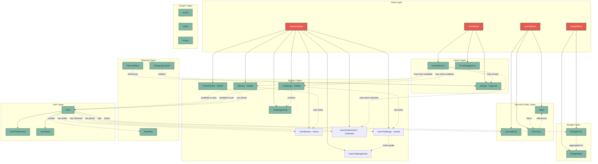
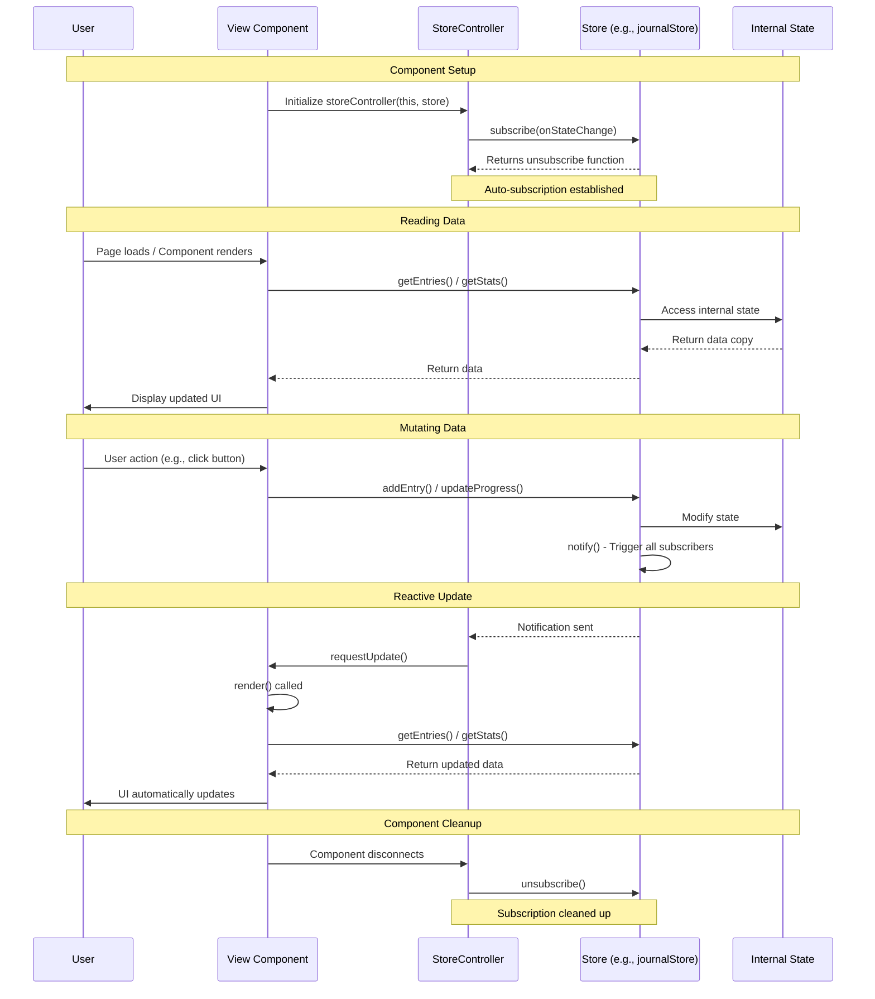
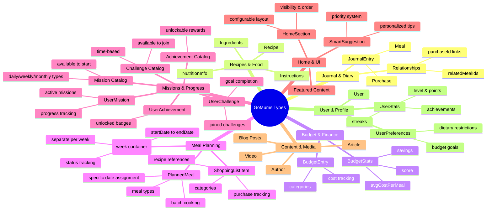

# GoMums Data Types - Architecture Diagrams

This file contains all the mermaid diagrams visualizing the data type architecture.

## 1. Complete Class Diagram

All types with their properties, inheritance, and relationships.

```mermaid
classDiagram
    %% Journal & Diary Types
    class JournalEntry {
        +string id
        +string type
        +Date timestamp
        +string title
        +string mealType?
        +number portions?
        +string status?
        +string store?
        +number cost?
        +string[] items?
    }
    
    class Meal {
        +string type = "meal"
        +string mealType
        +number portions?
        +number portionsLeft?
        +string status
        +string[] ingredientsUsed?
        +string purchaseId?
        +boolean isBatch?
        +boolean usedLeftovers?
        +boolean needsRestock?
    }
    
    class PurchaseItem {
        +string name
        +string quantity?
        +number cost
        +string category?
    }
    
    class Purchase {
        +string type = "purchase"
        +string store
        +PurchaseItem[] items
        +string[] relatedMealIds
        +number totalCost?
    }
    
    Purchase --> PurchaseItem : contains
    
    JournalEntry <|-- Meal
    JournalEntry <|-- Purchase
    Meal --> Purchase : linked by purchaseId
    Purchase --> Meal : references meals
    
    %% Recipe Types
    class Recipe {
        +string id
        +string name
        +string image
        +string prepTime?
        +number servings?
        +number calories?
        +string difficulty?
        +string[] ingredients?
        +string[] instructions?
        +NutritionInfo nutrition?
    }
    
    class NutritionInfo {
        +string protein
        +string carbs
        +string fat
        +string fiber?
        +number calories?
    }
    
    Recipe --> NutritionInfo : has
    
    %% Budget Types
    class BudgetStats {
        +number score
        +number avgCostPerMeal
        +number savingsVsRestaurant
        +number mealsThisWeek
        +number totalSpent
        +number weeklyBudget?
        +number remainingBudget?
    }
    
    class BudgetEntry {
        +string id
        +Date date
        +string mealName
        +number cost
        +number servings
        +number costPerServing
        +string category
        +string notes?
    }
    
    BudgetEntry --> BudgetStats : aggregated into
    
    %% Meal Planning Types
    class MealPlan {
        <<week container>>
        +string id
        +string name
        +Date startDate
        +Date endDate
        +PlannedMeal[] meals
        +ShoppingListItem[] shoppingList?
        +number totalCost?
        +string status?
    }
    
    class PlannedMeal {
        +string id
        +Date date
        +string mealType
        +string recipeId?
        +string recipeName
        +number servings
        +boolean isBatch?
        +boolean isLeftovers?
    }
    
    class ShoppingListItem {
        +string id
        +string name
        +string quantity
        +string category
        +boolean purchased
        +number estimatedCost?
        +string[] relatedRecipes?
    }
    
    MealPlan --> PlannedMeal : contains
    MealPlan --> ShoppingListItem : contains
    PlannedMeal --> Recipe : references
    ShoppingListItem --> Recipe : related to
    
    %% Missions & Challenges (Global + User-Specific)
    class Mission {
        <<catalog>>
        +string id
        +string title
        +string type
        +string category
        +number target
        +string difficulty?
        +number rewardPoints?
    }
    
    class UserMission {
        <<user progress>>
        +string id
        +string userId
        +string missionId
        +string status
        +number progress
        +Date startedAt
        +Date expiresAt?
    }
    
    class Challenge {
        <<catalog>>
        +string id
        +string title
        +string type
        +number duration
        +ChallengeGoal[] goals
        +string[] rewards
    }
    
    class UserChallenge {
        <<user progress>>
        +string id
        +string userId
        +string challengeId
        +string status
        +number progress
        +Date startedAt
    }
    
    class ChallengeGoal {
        +string id
        +string description
        +number target
    }
    
    class UserChallengeGoal {
        +string id
        +string goalId
        +boolean completed
        +number progress
    }
    
    class Achievement {
        <<catalog>>
        +string id
        +string title
        +string icon
        +string category
        +number target?
    }
    
    class UserAchievement {
        <<unlocked>>
        +string id
        +string achievementId
        +Date unlockedDate
        +number progress?
    }
    
    Mission --> UserMission : user starts
    Challenge --> UserChallenge : user joins
    Challenge --> ChallengeGoal : contains
    UserChallenge --> UserChallengeGoal : tracks
    UserChallengeGoal --> ChallengeGoal : references
    Mission --> Achievement : rewards
    Challenge --> Achievement : rewards
    Achievement --> UserAchievement : user unlocks
    User --> UserMission : has active
    User --> UserChallenge : has joined
    User --> UserAchievement : has unlocked
    
    %% Home Section Types
    class HomeSection {
        +string id
        +string type
        +string title
        +string subtitle?
        +boolean visible
        +number order
        +any data?
    }
    
    class SmartSuggestion {
        +string id
        +string title
        +string subtitle
        +string description
        +string type
        +string dotColor
        +string actionText?
        +number priority
    }
    
    HomeSection --> Recipe : may contain
    HomeSection --> Challenge : may contain
    HomeSection --> Achievement : may contain
    HomeSection --> SmartSuggestion : may contain
    
    %% Content Types
    class Article {
        +string id
        +string title
        +string content
        +string image
        +string category
        +string readTime
        +Author author
        +Date publishedDate
    }
    
    class Author {
        +string name
        +string avatar
        +string bio?
    }
    
    class Video {
        +string id
        +string title
        +string url
        +string thumbnail
        +string duration
    }
    
    Article --> Author : has
    
    %% User Types
    class User {
        +string id
        +string name
        +string email
        +string avatarUrl?
        +string oauthProvider?
        +string oauthId?
        +UserPreferences preferences
        +UserStats stats
        +Date createdAt
    }
    
    class UserPreferences {
        +string[] dietaryRestrictions?
        +string[] allergies?
        +number budgetGoal?
        +number householdSize?
        +string skillLevel?
    }
    
    class UserStats {
        +number totalMealsCooked
        +number totalMoneySaved
        +number currentStreak
        +number achievementsUnlocked
        +number level?
        +number points?
    }
    
    User --> UserPreferences : has
    User --> UserStats : has
    User --> UserMission : has active
    User --> UserChallenge : has joined
    User --> UserAchievement : has unlocked
    User --> MealPlan : creates
    User --> JournalEntry : logs
    User --> BudgetEntry : tracks
```

## 2. Store to Types Relationship Map

Shows which stores manage which types and their relationships.

## 3. Data Flow & Reactivity Sequence

Shows how data flows through the app with reactive updates.

## 4. Type Categories Mind Map

High-level overview of all type categories and their key features.

---

## How to View

These diagrams can be viewed in:
- **GitHub** - Renders mermaid automatically in markdown
- **VS Code** - Install "Markdown Preview Mermaid Support" extension
- **Mermaid Live Editor** - Copy/paste to https://mermaid.live

## Key Relationships

### Inheritance
- `JournalEntry` ← `Meal`, `Purchase`

### Composition (has-a)
- `User` has `UserPreferences`, `UserStats`
- `Recipe` has `NutritionInfo`
- `Challenge` contains `ChallengeGoal[]`
- `UserChallenge` tracks `UserChallengeGoal[]`
- `MealPlan` (week container) contains `PlannedMeal[]`, `ShoppingListItem[]`
  - Each week is a separate MealPlan
  - Meals and shopping lists belong to that specific week

### Association (references)
- `Meal` → `Purchase` (via purchaseId)
- `Purchase` → `Meal[]` (via relatedMealIds)
- `PlannedMeal` → `Recipe` (via recipeId)
- `ShoppingListItem` → `Recipe[]` (via relatedRecipes)
- `BudgetEntry` aggregates into `BudgetStats`
- `UserMission` → `Mission` (via missionId)
- `UserChallenge` → `Challenge` (via challengeId)
- `UserAchievement` → `Achievement` (via achievementId)
- `UserChallengeGoal` → `ChallengeGoal` (via goalId)

### Store Management
- **journalStore**: JournalEntry, Meal, Purchase
- **budgetStore**: BudgetStats, BudgetEntry
- **missionsStore**: 
  - Global: Mission, Challenge, ChallengeGoal, Achievement
  - User-specific: UserMission, UserChallenge, UserChallengeGoal, UserAchievement
- **homeStore**: HomeSection, SmartSuggestion, Recipe (featured)
